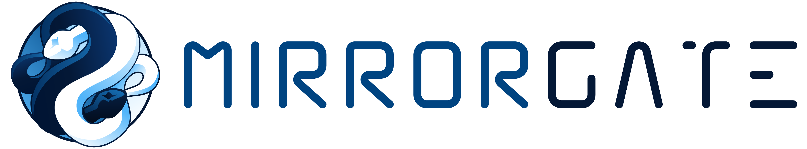
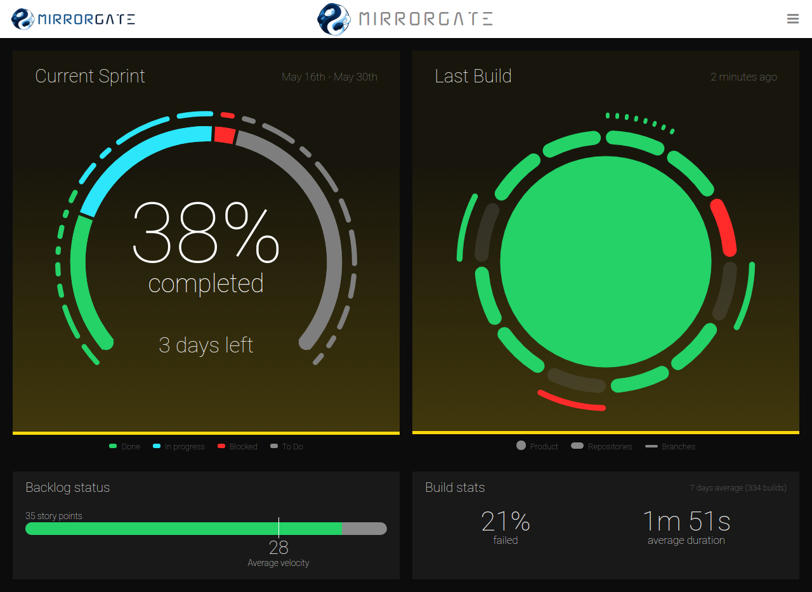

MirrorGate is a WallBoard application meant to give teams fast feedback in all the different areas related to software development.

     

## Why that name?

MirrorGate is meant to display relevant information on how your software looks like from every perspective, from the planning to the user’s feedback. So it's the mirror where teams can see their work reflected, helping them to perform self-criticism and continuous improvement. It aims to improve software quality and time-to-market by making the team aware of how the software it is developing and its process looks like.

That said, to be honest, it all comes from this dialog from `The Never Ending Story`:

* Engywook: Next is the Magic Mirror Gate. Atreyu has to face his true self.
* Falcor: So what? That won't be too hard for him.
* Engywook: Oh, that's what everyone thinks! But kind people find out that they are cruel. Brave men discover that they are really cowards! Confronted by their true selves, most men run away screaming!

## Functionality

Right now MirrorGate offers information on:
- Sprint advance status and backlog refinement.
- Program Increment (PI) advance status.
- Incidences visualization by criticality.
- Build status per repository.
- Build statistics and failure tendency.
- Marketplace feedback for mobile applications both in iTunes and PlayStore.
- Active users from Google Analytics.
- Alerts.
- Slack notifications.

We expect to be adding much more information in the near future so stay tuned.

Additionally, MirrorGate offers a backoffice application where dashboards can be configured.

## Spinning up a simple local environment

To execute a simple local environment with Jira and Jenkins capabilities, please check the [mirrorgate-sample-deployment](https://github.com/BBVA/mirrorgate-sample-deployment) project.

# Architecture

In order to operate, MirrorGate requires several components:

- Main MirrorGate application: typically executed by using the `bbva-ae/mirrorgate` docker container.
- MongoDB database. Should be bound to the application by using the `SPRING_DATA_MONGODB_URI` environment variable (for example `SPRING_DATA_MONGODB_URI=mongodb://localhost:27017/dashboarddb`).
- [Collectors](https://github.com/BBVA?utf8=%E2%9C%93&q=mirrorgate%20collector&type=&language=): collectors are components in charge of seeking and pushing information to the application. Currently, the following collectors exist:
    - Jenkins plugin: is a plugin that pushes information from a Jenkins CI server.
    - Jira collector: is a standalone application that polls Jira servers for changes every configurable amount of time.
    - Market collector: is a standalone process that polls smartphone applications marketplaces for user reviews.

## Security

MirrorGate currently doesn't have a security layer built in. If you want to secure it, you will have to put it behind a reverse proxy such as NginX and rely on perimeter security. Ensure to propagate the authenticated user name by using the X-Forwarded-User header so that the user that makes changes in a dashboard's configuration through the backoffice can be retrieved.

# Building and executing locally

## Build Dependencies

You need the following dependencies installed in order to build the project:

- [nodejs >= 6](https://nodejs.org)
- [jdk >= 8](http://openjdk.java.net/)
- [docker](https://www.docker.com/)
- [docker-compose](https://docs.docker.com/compose/): optional but strongly recommended in order to be able to execute some of the scripts.

## Project Structure

Contains folders for each of the modules:
- [mirrorgate-dashboard](./mirrorgate-dashboard/readme.md): contains the front-end sources.
- [mirrorgate-backoffice](./mirrorgate-backoffice/README.md): contains the dashboard administration application.
- [mirrorgate-api](./mirrorgate-api/Readme.md): contains the API (back-end) sources.
- [mirrorgate-core](./mirrorgate-core/Readme.md): contains the core library used by the API and the collectors.
- [docker](./docker/README.md): contains utilities to build a MirrorGate docker image.
- [tests](./tests/README.md): contains utilities to put all the pieces together and execute them as a whole while developing.

Check each of these folders for instructions on how to build, deploy and run each module.

## How to execute

To execute MirrorGate locally:

0. Ensure you have all the build dependencies installed.
1. Clone this repository.
2. Execute `scripts/buildAndRun.sh`.
3. Wait some time until the message **Tomcat started on port(s): 8080** appears.
3. Open [http://localhost:8080/mirrorgate/backoffice/index.html](http://localhost:8080/mirrorgate/backoffice/index.html) to access the WallBoards' backoffice.
4. You should be able to navigate through the mock dashboards.
5. Attempt to run some of the collectors (e.g. Jira) to be able to populate some information inside the database.

# Supported browsers

In MirrorGate we use some edge HTML and CSS features, thus only latest Chrome and Firefox versions are supported at the moment (i.e. IE and Safari are not currently supported).

# Contributing

Please read the [contributing guide](./CONTRIBUTING.md).

# Credit

This project is inspired by [CapitalOne's Hygieia](https://github.com/capitalone/Hygieia).