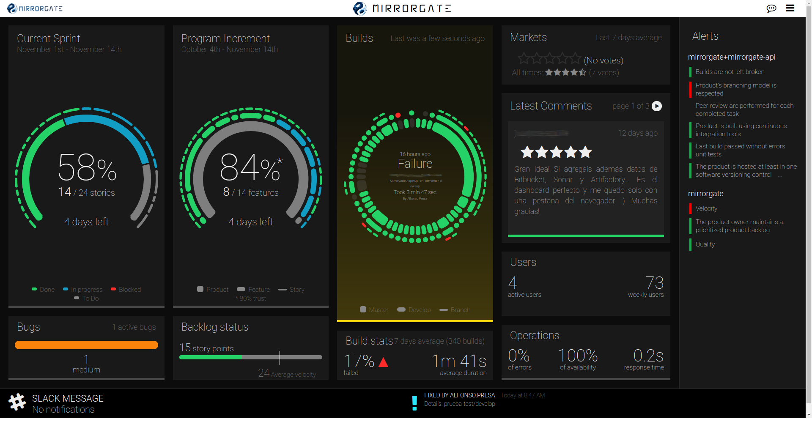
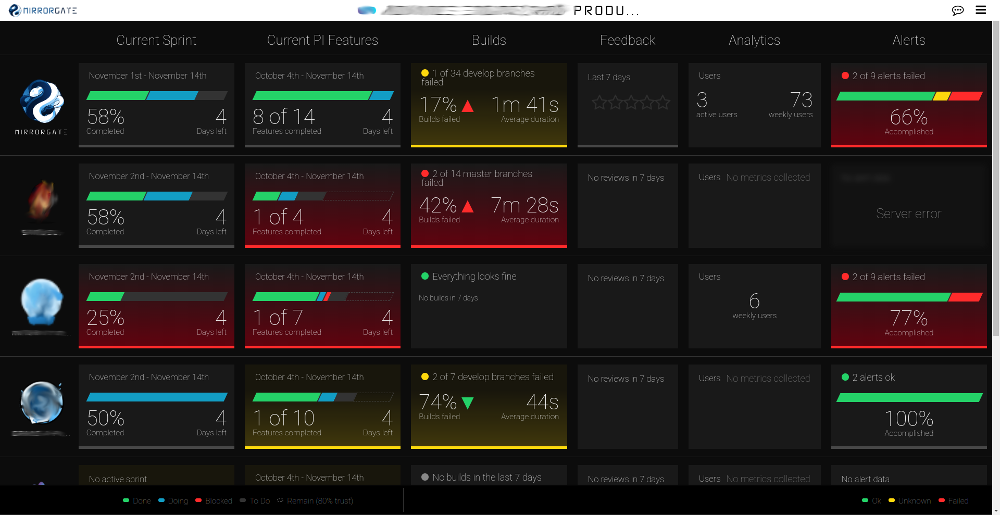
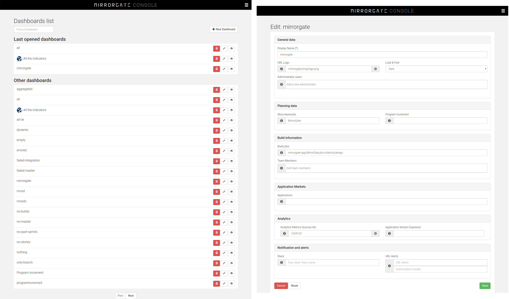

MirrorGate is a WallBoard application meant to give teams fast feedback in all the different areas related to software development.

[](https://github.com/BBVA/mirrorgate/blob/master/LICENSE) [](https://github.com/BBVA/mirrorgate/issues) [](https://github.com/BBVA/mirrorgate/stargazers) [](https://github.com/BBVA/mirrorgate/network) [](https://hub.docker.com/r/bbvaae/mirrorgate/) [](https://hub.docker.com/r/bbvaae/mirrorgate/)

## Why that name?

MirrorGate is meant to display relevant information on how your software looks like from every perspective, from the planning to the user’s feedback. So it's the mirror where teams can see their work reflected, helping them to perform self-criticism and continuous improvement. It aims to improve software quality and time-to-market by making the team aware of how the software it is developing and its process looks like.

That said, to be honest, it all comes from this dialog from `The Never Ending Story`:

* Engywook: Next is the Magic Mirror Gate. Atreyu has to face his true self.
* Falcor: So what? That won't be too hard for him.
* Engywook: Oh, that's what everyone thinks! But kind people find out that they are cruel. Brave men discover that they are really cowards! Confronted by their true selves, most men run away screaming!

## Functionality

Right now MirrorGate offers different dashboard types and views:

### Detail dashboard

Offers information on:
* Sprint advance status and backlog refinement.
* Program Increment (PI) advance status.
* Incidences visualization by criticality.
* Build status per repository.
* Build statistics and failure tendency.
* Marketplace feedback for mobile applications in iTunes, PlayStore or [directly captured](#feedback).
* Active users from Google Analytics and Adobe Analytics.
* AWS operation metrics.
* Alerts.
* Slack notifications.



We expect to be adding much more information in the near future so stay tuned.

### Aggregate dashboard

It also offers a view where you can display several product dashboards in a single view with a more summed up information.




### Backoffice

Additionally, MirrorGate offers a backoffice application where dashboards can be configured.




# Supported browsers

In MirrorGate we use some edge HTML and CSS features, thus only latest Chrome and Firefox versions are supported at the moment (i.e. IE and Safari are not currently supported).

<a name="feedback"></a>

# Collecting feedback

MirrorGate ecosystem includes a markets-collector to be able to fetch feedback directly from the iOS and Android App Stores. Eventhough, it also offers an [endpoint](./collect-feedback.md) that might be invoked to directly send feedback on an specific product (directly from the front via form post or ajax request or from server side).

# Running

MirrorGate server is provided as a docker image, so to run it simply execute the following commands in a terminal:

```sh
#Spinup mongo db
docker run --name mongo mongo > /dev/null &

#Run mirrorgate without security
docker run --env "SPRING_DATA_MONGODB_URI=mongodb://mongo:27017/dashboard" --env "SPRING_PROFILES_ACTIVE=embedded" --link="mongo" -p8080:8080 bbvaae/mirrorgate
```

Navigate to [mirrorgate console](http://localhost:8080/backoffice/index.html) in your local server, create a new dashboard and set the "Build Jobs" field to *MirrorGateTest*. Save it and navigate into the dashboard by cllicking the "eye" icon.

While keeping the dashboard opened run the following command:

```sh
curl -0 -v http://localhost:8080/api/builds \
-H "Expect:" \
-H 'Content-Type: application/json; charset=utf-8' \
-d @- << EOF
{
    "number" : "$(date +%s)",
    "buildStatus" : "Failure",
    "buildUrl": "#$(date +%s)",
    "timestamp": $(date +%s)000,
    "projectName" : "MirrorGateTest",
    "repoName" : "MyRepo",
    "branch" : "master"
}
EOF
```

You will now see the build status in the opened dashboard.

You now have an environment ready to receive information from the several [collectors available](https://github.com/BBVA?utf8=%E2%9C%93&q=mirrorgate%20collector&type=&language=).

> To execute a simple local environment with Jira and Jenkins capabilities, please check the [mirrorgate-sample-deployment](https://github.com/BBVA/mirrorgate-sample-deployment) project.


# Architecture

In order to operate, MirrorGate requires several components:

- Main MirrorGate application: typically executed by using the `bbva-ae/mirrorgate` docker container.
- MongoDB database. Should be bound to the application by using the `SPRING_DATA_MONGODB_URI` environment variable (for example `SPRING_DATA_MONGODB_URI=mongodb://localhost:27017/dashboarddb`).
- [Collectors](https://github.com/BBVA?utf8=%E2%9C%93&q=mirrorgate%20collector&type=&language=): collectors are components in charge of seeking and pushing information to the application. Currently, the following collectors exist:
    - Jenkins plugin: is a plugin that pushes information from a Jenkins CI server.
    - Jira collector: is a standalone application that polls Jira servers for changes every configurable amount of time.
    - Market collector: is a standalone process that polls smartphone applications marketplaces for user reviews.

# Security

MirrorGate currently doesn't provide any authentication mechanism so if you want to secure it you will have to deploy it behind a reverse proxy.

It provides 3 different authorization depending on the value of the `X-Forwarded-User` header provided by the reverse proxy:

- If the value of the header is `ANONYMOUS`, the access will be annonymous. The user will have read only access to the dashboards. This is meant to be use to place the dashboard in screens without the need of user authentication.
- If the header is not set or equals `COLLECTOR` access to the `/api` endpoints will be granted, allowing the source system to push information. This is typically meant to be used for collectors and that's why it allows the header not to be provided in case you rely in perimetral security and the collectors access MirrorGate from behind the reverse proxy.
- For any other case, the header is taken as the user id. It will have access to dashboards both write and read.

> If you wan to completely disable the security in MirrorGate you can execute it with the env variable `SPRING_PROFILES_ACTIVE=embedded`.

# For Developers

## Build Dependencies

You need the following dependencies installed in order to build the project:

- [nodejs >= 6](https://nodejs.org)
- [jdk >= 8](http://openjdk.java.net/)
- [docker](https://www.docker.com/)
- [docker-compose](https://docs.docker.com/compose/): optional but strongly recommended in order to be able to execute some of the scripts.

## Project Structure

Contains folders for each of the modules:
- [mirrorgate-dashboard](./mirrorgate-dashboard/readme.md): contains the front-end sources.
- [mirrorgate-backoffice](./mirrorgate-backoffice/README.md): contains the dashboard administration application.
- [mirrorgate-api](./mirrorgate-api/Readme.md): contains the API (back-end) sources.
- [mirrorgate-core](./mirrorgate-core/Readme.md): contains the core library used by the API and the collectors.
- [docker](./docker/README.md): contains utilities to build a MirrorGate docker image.
- [tests](./tests/README.md): contains utilities to put all the pieces together and execute them as a whole while developing.

Check each of these folders for instructions on how to build, deploy and run each module.

## How to execute

To execute MirrorGate locally:

0. Ensure you have all the build dependencies installed.
1. Clone this repository.
2. Execute `scripts/buildAndRun.sh`.
3. Wait some time until the message **Tomcat started on port(s): 8080** appears.
3. Open [http://localhost:8080/mirrorgate/backoffice/index.html](http://localhost:8080/mirrorgate/backoffice/index.html) to access the WallBoards' backoffice.
4. You should be able to navigate through the mock dashboards.
5. Attempt to run some of the collectors (e.g. Jira) to be able to populate some information inside the database.

# Contributing

Please read the [contributing guide](./CONTRIBUTING.md).

# Credit

This project is inspired by [CapitalOne's Hygieia](https://github.com/capitalone/Hygieia).